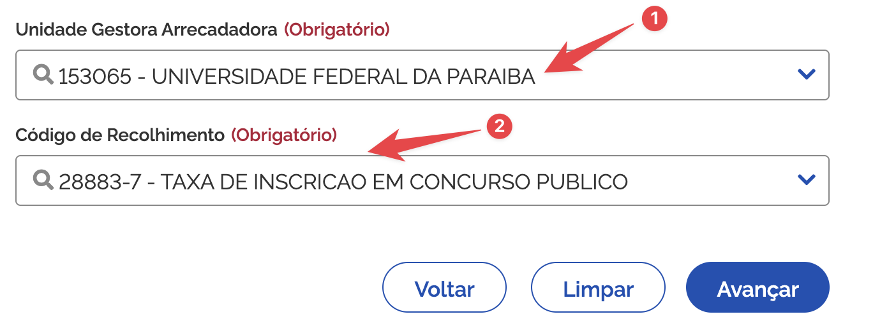
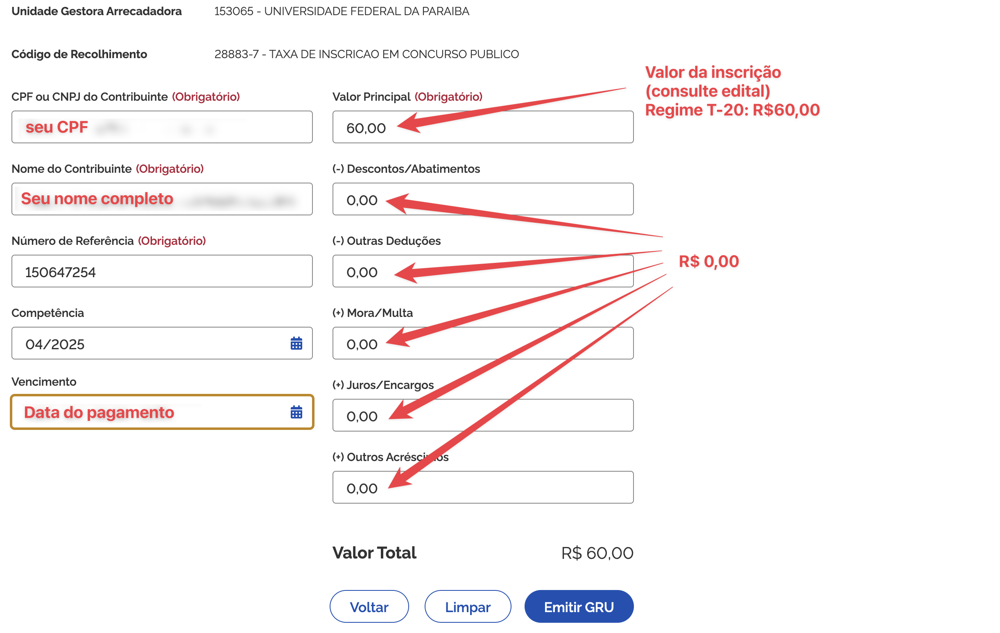

# Concurso para Professor Substituto – Departamento de Ciências Exatas (CCAE/UFPB)


**⚠️ [Acesse aqui o edital](EDITAL 17_2025-ProfSubstituto.pdf)**

**⚠️ ATENÇÃO! Se alguma informação divergir entre o que está informado nesta página e o que está no [edital](EDITAL 17_2025-ProfSubstituto.pdf), considere a informação do edital e, por favor, informe a divergência à comissão do concurso: [concursos@dcx.ufpb.br](mailto:concursos@dcx.ufpb.br)**

---

## Informações Gerais

Este concurso visa à contratação de **Professores Substitutos** para o **Departamento de Ciências Exatas (DCX)** do **Centro de Ciências Aplicadas e Educação (CCAE)** da **UFPB – Campus IV (Rio Tinto/PB)**.

**Endereço:** Av. Santa Elizabeth, S/N, Centro – Rio Tinto/PB  
**Contato:** [concursos@dcx.ufpb.br](mailto:concursos@dcx.ufpb.br)  


## Vagas Disponíveis

### 1. Infraestrutura de Redes de Computadores

- **Regime:** 20 horas semanais (T-20)  
- **Classe:** A – Assistente  
- **Vagas:** 1 (Ampla Concorrência)  
- **Requisito mínimo:** Mestrado em Ciência da Computação ou Engenharia da Computação e áreas afins  

### 2. Linguagem de Programação

- **Regime:** 20 horas semanais (T-20)  
- **Classe:** A – Assistente  
- **Vagas:** 1 (Pessoa Preta ou Parda – PPP)  
- **Requisito mínimo:** Mestrado em Ciência da Computação e áreas afins  

## Calendário do Concurso

| Etapa                         | Data                       |
|------------------------------|----------------------------|
| **Prova Didática**           | 30/04/2025                 |
| **Prova de Títulos**         | 05/05/2025                 |
| **Resultado Preliminar**     | 09/05/2025                 |

> ⚠️ As datas são prováveis e podem ser confirmadas neste site.

## Inscrição

- **Período:** 14 a 23 de abril de 2025  
- **Taxa:**
  - R$ 60,00 (regime T-20)
- **Formas de inscrição:**  
  - Presencial  
  - Via postal (SEDEX com AR)  
  - Por procuração  

### Documentos exigidos:

📂[Acesse esta pasta](https://drive.google.com/drive/u/0/folders/1FOGRLHTfKxAM0MusXDPWZZJcurqJ-0ef) para acessar os modelos de requerimento de inscrição e termo de autodeclaração.

## Como se inscrever no concurso

**PASSO 1:** Preencha o **[Requerimento de inscrição](https://drive.google.com/drive/u/0/folders/1FOGRLHTfKxAM0MusXDPWZZJcurqJ-0ef)**.

**PASSO 2:** Gere a GRU para pagar a **taxa de inscrição**:

- **Acesse o [site Tesouro Nacional](https://pagtesouro.tesouro.gov.br/portal-gru/#/emissao-gru)** e **gere uma GRU**.  
  *No site, informe os dados a seguir:*
  - (1) Unidade Gestora Arrecadadora: `153065`
  - (2) Código de recolhimento: `28883-7 - TAXA DE INSCRIÇÃO EM CONCURSO PÚBLICO`
  - Clique em `Avançar`



- **Na página seguinte**, preencha o formulário com os seguintes dados:
  - CPF e nome completo
  - Número de referência: `150647254`
  - Competência: mês e ano atual (por exemplo, `04/2025`)
  - Vencimento: data do pagamento. Recomendamos informar a data em que você está preenchendo o formulário e realizar o pagamento no mesmo dia.
  - Valor principal: valor da inscrição. Para este concurso T-20: `R$ 60,00`
  - Informe `0,00` nos campos de Descontos, Outras deduções, Mora/Multa, Juros/Encargos e Outros acréscimos



**PASSO 3:** Pague a GRU (Não serão aceitos comprovantes de agendamento);

**PASSO 4:** Apresente a documentação no ato da inscrição. Você pode se inscrever **presencialmente**, **por procuração** ou **via postal - (Exclusivamente Sedex)**:

Junte os seguintes documentos:

1. ✅ Requerimento de inscrição
2. ✅ Comprovante de pagamento da GRU (não aceitamos comprovante de agendamento);
3. ✅ Cópia autenticada de documento oficial de identidade com foto e CPF;  
4. ✅ Foto 3x4 recente;
5. ✅ Currículo (Lattes ou Vitae) devidamente comprovado;
    - Ao preparar o currículo, **SUGERIMOS FORTEMENTE** que você organize os documentos de comprovação na ordem e de acordo com o ANEXO III do edital. 
    - Classifique cada comprovação de acordo com os itens da tabela.
    - Não envie comprovantes que não podem ser classificados segundo o ANEXO III.

**Se for se inscrever via postal**, envie a documentação, **usando SEDEX**, para:

```text
Departamento de Ciências Exatas
UFPB - Campus IV
Av. Santa Elizabeth, S/N - Centro
Rio Tinto/PB
CEP: 58.297-000
```


## Isenção da Taxa

**Solicitação entre 09 e 10 de abril de 2025**, por e-mail para [concursos@dcx.ufpb.br](mailto:concursos@dcx.ufpb.br).  
Podem solicitar:

- Inscritos no **CadÚnico** e membros de família de baixa renda;  
- **Doadores de medula óssea**, com documentação comprobatória.


## Observações Finais

- A contratação será por até **1 ano**, prorrogável.  
- Não é permitida nova contratação com base na Lei nº 8.745/93 antes de **24 meses** do encerramento de vínculo anterior como substituto.
- Acompanhe todas as atualizações no site de cada concurso:
    - [Linguagem de Programação](./linguagem_programação/index.md)
    - [Infraestrutura de Redes](./infraestrutura_redes/index.md)

