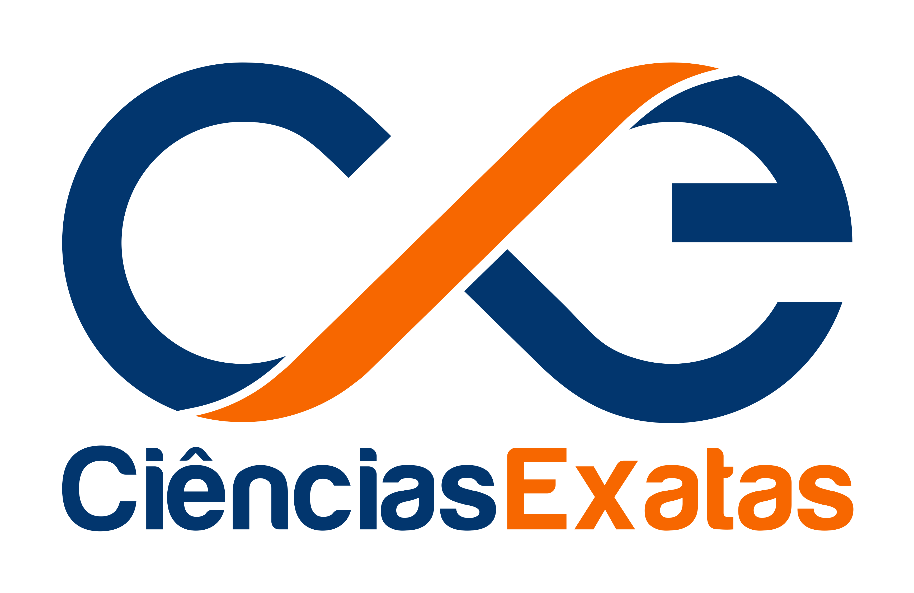

# Home 

Esta é a página para acompanhamento dos concursos do Departamento de Ciências Exatas (DCX), do Centro de Ciências Aplicadas e Educação (CCAE) - Campus IV da UPFB - Rio Tinto - PB.

- A página oficial do departamento é: [https://www.ufpb.br/dcx](https://www.ufpb.br/dcx)

